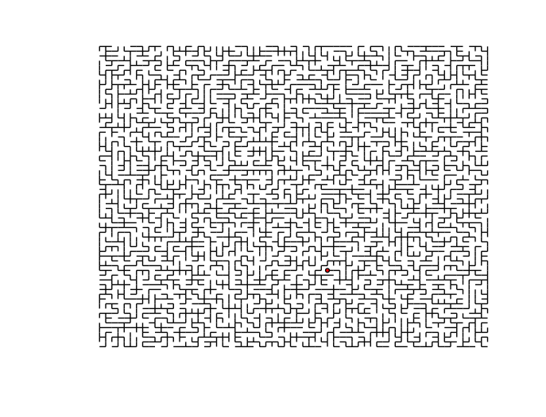

Python&C implementation of Wilson's algorithm for random spanning trees
=======================================================================

*Current version: 0.3*

Description
-----------

Wilson's algorithm samples the space of spanning trees of a given graph according
to the edge weights. Taking all edge-weights to be the same reduces to the sampling
of uniform spanning trees (USTs).

Implemented for a square/cubic lattice with periodic boundary conditions but flexible enough to extend to general graph G.

References
----------
- Itai Benjamini, Russel Lyons, Yuval Peres and Oded Schramm: Uniform spanning forests. http://www.jstor.org/discover/10.2307/2652913?uid=2&uid=4&sid=21102802567083
- Oded Schramm, Uniform spanning trees, loop-erased random walk, and scaling limits, http://research.microsoft.com/en-us/um/people/schramm/memorial/usf-talk.ps
